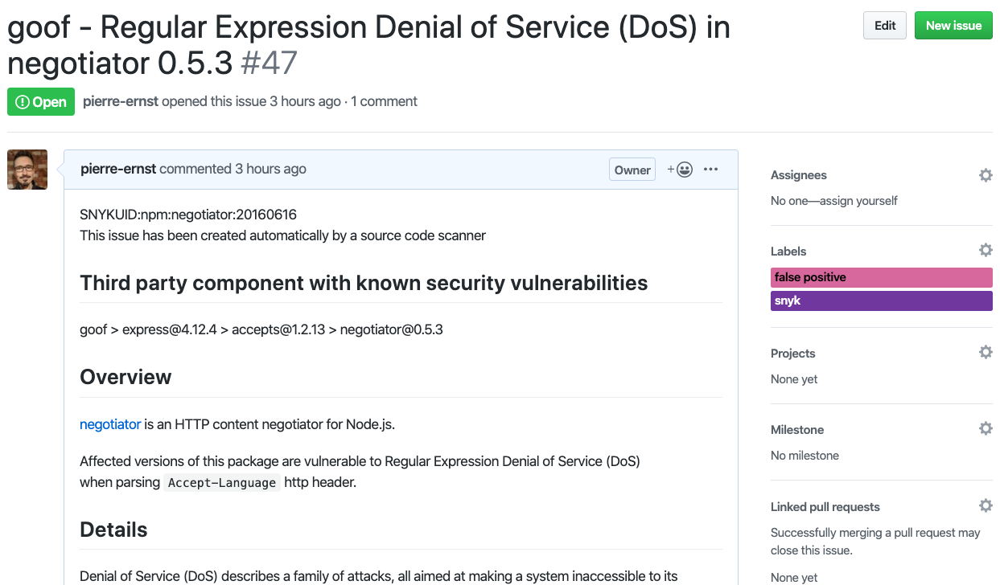

# GitHub Issue Creator

Creates GitHub issues from Snyk Project issues.

## Prerequisites

To use this tool you must first set:
1. an environment variable `SNYK_TOKEN` with your API key, as found at https://snyk.io/account.
1. an environment variable `GH_PAT` with a GitHub personal access token having enough privilege to create issues.

## Usage
You can find usage instructions by running:

```bash
node ./cli/index.js --help
```

```bash
node ./cli/index.js --snykOrg=<snykOrg> --snykProject=<snykProject> --ghOwner=<ghOwner> --ghRepo=<ghRepo> --ghLabels=<ghLabel>,... --projectName=<projectName> --autoGenerate
```

- You can retrieve your orgId from your org settings page on [Snyk](https://snyk.io) or via the [Snyk API](https://snyk.docs.apiary.io/#reference/organisations/the-snyk-organisation-for-a-request/list-all-the-organisations-a-user-belongs-to).
- The projectId is available via the [Snyk API](https://snyk.docs.apiary.io/#reference/projects/projects-by-organisation/list-all-projects).
- The optional projetName allows to overrride the project name from Snyk (usefull when runing Snyk with CI/CLI integration)

You will be presented with a list of *high* and *medium* vulnerability issues to
generate a GitHub issue for. Type `t` or `true` to create an issue,
and `f` or `false` to skip it.

### Auto generating gitHub issues

If you wish to automatically generate GitHub issues and force the confirmation prompt (e.g. if you want to run this as part of a CI pipeline), enter the flag `--autoGenerate`.

### Examples

Running the script against this repository will create a set of [issues](https://github.com/pierre-ernst/snyk-github-issue-creator/issues)


As seen here:




